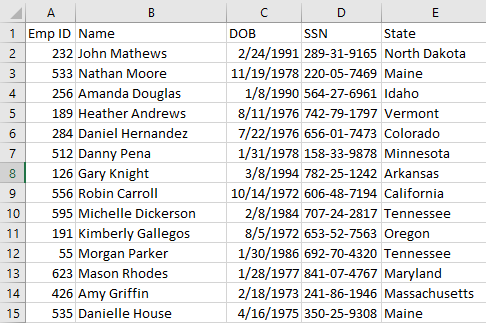
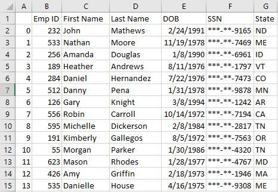

# Glowing Python Journey

## PyBoss | Employee Data

In this challenge, I am the _boss_ of the hundreds of employees across the country developing Tuna 2.0, a world-changing snack food based on canned tuna fish. 
The company recently decided to purchase a new HR system, and unfortunately for me, the new system requires employee records to be stored differently.

My task is to help bridge the gap by using Pandas to convert your employee records to the required format. 

(First, I used Python script to do all these tasks, but Pandas was much faster and comfortable in the job process.)

In my Jupyter notebook, my data includes: 

* Split the `Name` column into two separate `First Name` and `Last Name` columns.

* Rewrite the `DOB` (Date of Birth) column into the `MM/DD/YYYY` format. 

* Hide the first five numbers of the `SSN` in the `SSN` column. 

* Rewrite the `State` data as simple two-letter abbreviations. 

Original Data: 

Cleaned Data:

## PyParagraph

In this challenge, I am a chief linguist at a local learning academy. 
As a chief linguist, I am responsible for assessing the complexity of various passages of writing, ranging from the sophomoric Twilight novel to the nauseatingly high-minded research article. Having read so many passages, I've come up with a fairly simple set of metrics for assessing complexity. 

My task is to create a Python script to automate the analysis of any such passage using these metrics. 

Complete the following tasks for this project: 

- [ ] Import a text file filled with a paragraph of your choosing.
- [ ] Approximate word count
- [ ] Approximate sentence count
- [ ] Approximate letter count (per word)
- [ ] Average sentence length (in words)
- [ ] Screenshots of Analysis
  

© Erika Yi. All Rights Researved. 